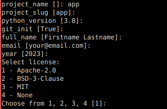
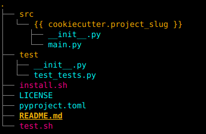

# Python Cookiecutter Template

A [Cookiecutter](https://cookiecutter.readthedocs.io/en/latest/README.html) template for a basic python project with a [src layout](https://packaging.python.org/en/latest/discussions/src-layout-vs-flat-layout/).

Includes:

- pyproject.toml
- test directory
- license (Apache-2.0, MIT, BSD-3-Clause, or none)
- README stub
- git initialization

Prompts:



Directory layout:




### Prerequisites

[Cookiecutter](https://cookiecutter.readthedocs.io/en/latest/installation.html) must be installed:

```bash
pip install --user cookiecutter
```


## Usage

Use with:

```bash
cookiecutter https://github.com/vishusandy/python_cookiecutter
```

You will be prompted for project information.


### .cookiecutterrc

I recommend the following for your [`~/.cookiecutterrc`](https://cookiecutter.readthedocs.io/en/latest/advanced/user_config.html) file:

```
default_context:
    full_name: "<your name>"
    email: "<your email>"
    license: "Apache-2.0"
```


### Alias

Personally I find a bash alias makes this easier:

```bash
alias pyp="cookiecutter https://github.com/vishusandy/python_cookiecutter"
```

which would be called by running `pyp` in the terminal.
